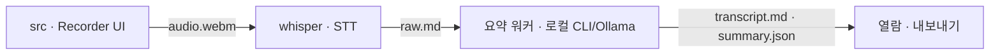

# AI NOTE — 회의 녹음 → 회의록 요약

> 모델·도구 무관 **에이전트 진입점**. Claude Code·Codex 등 어떤 에이전트가 열어도 이 파일을 먼저 읽는다. `CLAUDE.md`는 이 파일의 심링크(내용 하나). 사람 온보딩은 [README.md](README.md).

로컬 단일 사용자 웹앱. 노트북 마이크 녹음 → 로컬 whisper 배치 전사 → 로컬 CLI(claude/codex)·Ollama 교정·요약 → 열람·내보내기. 상세 기획은 [docs/PRD.md](docs/PRD.md), 계약·데이터흐름은 [docs/ARCHITECTURE.md](docs/ARCHITECTURE.md), 디자인은 [docs/UI_GUIDE.md](docs/UI_GUIDE.md).

## 데이터 흐름 · Dependencies (cross-module)



- 흐름: `src`(녹음/API) → `whisper`(HTTP 127.0.0.1) → 요약 워커(로컬 CLI/Ollama) → 열람·내보내기. 단일 writer 소유권은 아래 CRITICAL 참조.
- 모듈별 상세: [src/CLAUDE.md](src/CLAUDE.md) · [whisper/CLAUDE.md](whisper/CLAUDE.md) · [scripts/CLAUDE.md](scripts/CLAUDE.md).
- 결정 기록(ADR): [docs/decisions/](docs/decisions/) · AI 기능 품질: [evals/](evals/).

## 기술 스택
- Next.js 15 (App Router) · TypeScript strict · Tailwind CSS
- 로컬 whisper 서비스: Python(**uv로 3.11/3.12 핀 venv**, 시스템 3.14 금지), mlx-whisper large-v3(폴백 faster-whisper), `127.0.0.1`
- 테스트: Vitest(+ RTL/jsdom component test). Playwright e2e는 MVP-0 제외.
- 저장: 로컬 파일(`data/meetings/{id}/`) — DB 없음.

## 설치 (Installation)

> 사람 대상 요약은 `README.md`. 이 절차는 **에이전트가 레포 URL을 받아 clone 후 그대로 실행**하면 설치가 완료되도록 자기완결적으로 쓴다. `npm run dev` 두 줄이 정본이지만, npm 바깥 전제 도구 3종(`uv`·`ffmpeg`·요약기)은 사용자/에이전트가 준비해야 하므로 아래 순서를 따른다.

0. **Node ≥ 20 확보** — `node -v`. 없거나 낮으면 nvm 또는 OS 패키지 매니저로 설치(이게 있어야 나머지가 돈다).
1. **진단** — `node scripts/setup.mjs`. 이 닥터는 무의존이라 `npm install` 전에도 돈다. Node·`uv`·`ffmpeg`·요약기·`.env.local`을 ✓/⚠/✗로 보고하고, 필수(Node/uv/ffmpeg) 미충족이면 exit 1.
2. **✗ 전제 설치(OS 감지 후 실제 실행 — 사용자에게 보이게, sudo/확인 필요할 수 있음)**:
   - `ffmpeg` — macOS `brew install ffmpeg` · Debian/Ubuntu `sudo apt install ffmpeg` · Windows `choco install ffmpeg`.
   - `uv` — https://docs.astral.sh/uv/ 설치 스크립트(또는 macOS `brew install uv`). whisper venv/모델은 `npm run dev`가 런타임에 처리한다(여기서 `uv sync`·모델 다운로드 하지 말 것).
3. **의존성** — `npm install`.
4. **요약기 준비(자동화 불가한 유일한 수동 단계)** — Claude/Codex CLI 또는 로컬 Ollama 중 하나. 이미 있으면 그대로 두고, 없으면 하나 준비: `claude` 로그인 · `codex` · `ollama serve` + `ollama pull <model>`. **provider 선택·검증은 `npm run dev` 기동 후 앱 Settings 화면에서** 한다(설치 시점엔 서버 미기동이라 API 설정 불가; `data/settings.json`은 app-api 단일 writer라 직접 쓰지 않는다).
5. **검증(포그라운드로 붙잡지 말 것)** — `node scripts/setup.mjs`(전부 ✓) + `npm run build`. 실제 구동 확인은 `LOCAL_STT_MODEL=base npm run dev`(백그라운드)로 띄운 뒤 `http://localhost:3000` / `GET /api/whisper/health`. `npm run dev`는 long-lived + 첫 모델 다운로드라 검증용으로 붙잡으면 안 된다.

Claude Code 세션이면 위 절차를 `/setup` 커맨드로 대신 실행할 수 있다(내용은 이 절차와 동일; Codex 등 다른 에이전트는 이 절차를 직접 따른다).

## 아키텍처 규칙

### CRITICAL — 반드시 지킬 것
- **TDD**: 새 기능은 테스트 먼저 작성 → 통과하는 구현.
- **원본 불가침**: `audio.webm`·`raw.md`·`segments.json`은 생성 후 수정 금지. `transcript.md`·`summary.json`은 재생성 가능.
- **원자적 쓰기**: 모든 아티팩트는 temp 파일 → `fsync` → `rename`으로 쓴다(부분쓰기 손상 방지).
- **파일 소유권(단일 writer)**: `status.json`=app-api만, `raw.md`/`segments.json`=whisper만, `transcript.md`/`summary.json`=요약 워커만. 남의 파일을 쓰지 않는다. app은 파일 존재로 상태를 파생한다. 회의 **삭제**는 `data/meetings/{id}/` 폴더 전체 폐기(rename-then-rm, ADR 0007); 사용자 지정 제목은 `status.json.titleOverride`로 app-api가 소유(ADR 0008).
- **앱은 API 키를 저장하지 않는다**: 교정·요약은 백그라운드 워커가 사용자의 로컬 CLI(claude/codex)나 Ollama로 수행한다. 앱 코드에 Anthropic/OpenAI **API 키·유료 API 호출**을 넣지 말 것 — 로컬 CLI/모델만($0 원칙).
- **build-green**: `next build`가 시크릿/DB/env 없이 매번 통과해야 한다. `data/`를 읽는 라우트·페이지는 `export const dynamic='force-dynamic'` + `cache:'no-store'`; top-level `process.env` 접근 금지(핸들러 내 지연); whisper 클라이언트 지연 초기화; `data/`가 없어도 견디게; MediaRecorder/Web Audio 코드는 `"use client"`; 라우트는 Node 런타임(edge 금지).
- **127.0.0.1 바인딩**: whisper·로컬 서버는 로컬 인터페이스만. LAN 노출 금지.
- **로컬 데이터 취급**: `data/`·`glossary.json`은 로컬 전용(gitignored, 커밋 금지) — 오디오·전사·요약·단어장(사람 이름 등 PII 포함 가능)은 디스크를 떠나지 않는다. 요약/내보내기물의 토큰·이메일·전화·URL **scrub은 지향 목표이나 현재 미구현**이며, 로컬 단일 사용자 hand-off 문서(`export`)엔 의도적으로 미적용한다(ADR 0007). 공유/업로드 표면이 생기면 그때 scrub을 강제한다.

### 일반 규칙
- 컴포넌트는 `src/components/`, 타입은 `src/types/`(또는 `src/domain/`), 유틸은 `src/lib/`, 외부 래퍼는 `src/services/`.
- 커밋 메시지는 conventional commits(feat:, fix:, docs:, refactor:, chore:).

## 개발 프로세스
- 모델 다운로드·긴 전사·`uv`/`npm install` 같은 무거운 작업은 **런타임에만**. 테스트·스모크는 tiny 모델/FAKE 스텁으로.

## 명령어
```bash
npm run dev         # next dev + 로컬 whisper 동시 기동(concurrently)
npm run build       # 프로덕션 빌드 (시크릿 없이 통과해야 함)
npm run lint        # ESLint
npm test            # vitest run (+ component test), watch 금지
npm run typecheck   # tsc --noEmit
npm run check:links # docs/context 마크다운 죽은 링크 0
```
