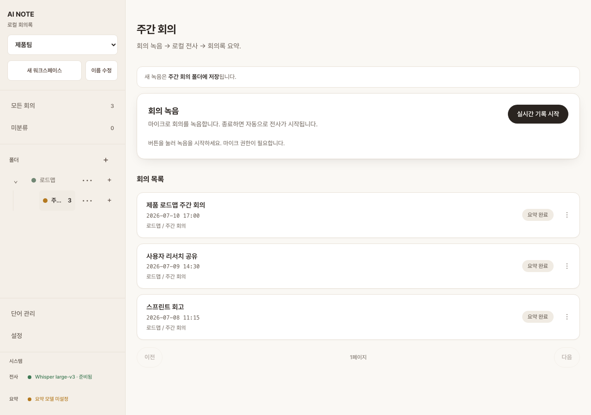
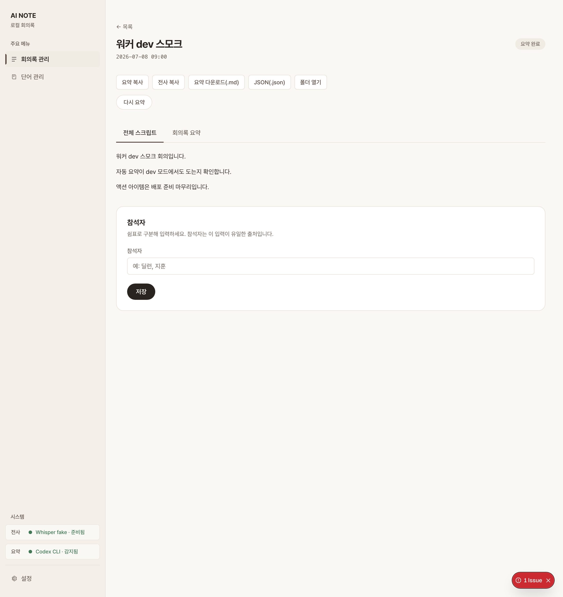
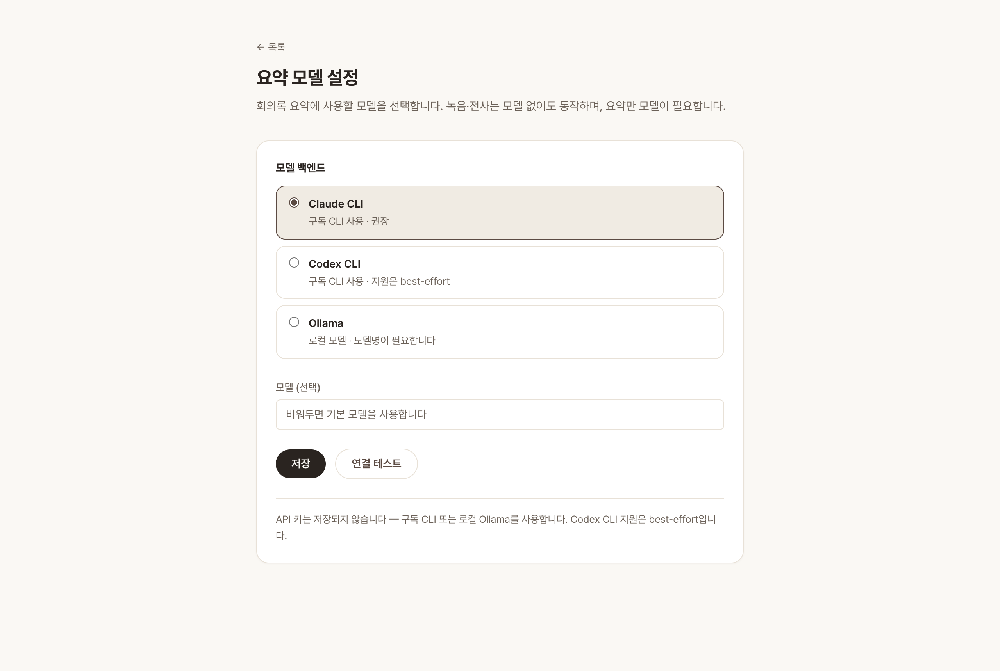

# AI NOTE

**Local-first meeting notes.** Record a meeting on your laptop → transcribe it locally with Whisper → get a clean, structured summary generated by *your own* AI (Claude CLI, Codex CLI, or a local Ollama model). Everything runs on `127.0.0.1`. No cloud, no accounts, no API keys stored.

The summary is yours — a `summary.json` and a Markdown transcript you can copy, download, drop into your notes, or feed anywhere else. AI NOTE does one thing: turn a recording into a good summary and hand it to you.

> UI strings are currently Korean (v0.1). Internationalization is planned — see [Roadmap](#roadmap).

## Screenshots

| Home | Structured summary | Model settings |
|:---:|:---:|:---:|
|  |  |  |

## Why it's private

- **All local.** Audio → transcription → summary all happen on your machine. The web server and the transcription service bind to `127.0.0.1` only (never your LAN).
- **No API keys.** Summaries run through a CLI you're already signed in to (Claude/Codex) or a local model (Ollama). AI NOTE never stores an API key.
- **No telemetry.** No analytics, no external calls. Recordings live under `data/` (gitignored) and never leave your disk.

## How it works

```
record (browser mic) → local Whisper (STT) → local AI summary (worker) → view / export
```

1. Click **Start** — audio is captured in the browser and saved locally.
2. On stop, a local **Whisper** service transcribes it (`raw.md`).
3. A background worker feeds the transcript to your configured model and writes a corrected transcript (`transcript.md`) + structured summary (`summary.json`) — automatically, even if you close the tab.
4. Review, then **copy / download / reveal the folder**.

## Requirements

| | |
|---|---|
| **Node.js** | ≥ 20 |
| **Python** | 3.11 or 3.12, via [`uv`](https://docs.astral.sh/uv/) (for the Whisper service) |
| **ffmpeg** | on your `PATH` (or set `FFMPEG_PATH`) |
| **A summarizer** | one of: **Claude CLI**, **Codex CLI**, or **[Ollama](https://ollama.com)** running locally |

### Platform support

| Platform | Transcription |
|---|---|
| **Apple Silicon (M-series)** | fast — uses `mlx-whisper` |
| **Linux / Windows / Intel Mac** | works — CPU fallback via `faster-whisper` (slower, no GPU path) |

The first run downloads a Whisper model. The default (`large-v3`) is multi-GB; set `LOCAL_STT_MODEL=base` (or `small`) for a much faster first run.

## Quick start

```bash
npm install        # deps (+ husky hooks)
npm run dev        # Next.js + local Whisper service (needs uv)
```

Open http://localhost:3000, pick a summarizer in **Settings**, and record.

```bash
npm test           # vitest
npm run build      # production build (passes with no secrets/env)
npm run lint
npm run typecheck
npm run check:links
```

## Configuration

Copy `.env.example` to `.env.local` and adjust as needed. Common knobs:

| Env | Default | Purpose |
|---|---|---|
| `LOCAL_STT_MODEL` | `large-v3` | Whisper model (`base`/`small` for speed) |
| `LOCAL_STT_LANG` | `ko` | Whisper decode language (`auto` to detect) |
| `LOCAL_STT_VAD` | `1` | Silence/hallucination filter (VAD); `0` to disable |
| `LOCAL_STT_HOST` / `LOCAL_STT_PORT` | `127.0.0.1` / `8123` | Whisper service address |
| `FFMPEG_PATH` | (from `PATH`) | Explicit ffmpeg binary |

Add domain terms the transcriber should get right in `glossary.json` (see `glossary.example.json`).

## Project layout

| Path | Role |
|------|------|
| `src/` | Next.js app — recorder UI, API routes, domain contracts |
| `whisper/` | Local STT service (Python, `127.0.0.1`) |
| `docs/` | PRD · ARCHITECTURE · UI_GUIDE + decision records |
| `scripts/` | dev tooling (link checker) |

Module boundaries & data flow → [docs/ARCHITECTURE.md](docs/ARCHITECTURE.md). Working with an AI agent? Start at [AGENTS.md](AGENTS.md).

## Roadmap

- Internationalized UI (English + others)
- One-command / packaged install
- More summarizer backends

## License

[MIT](LICENSE) © 2026 Dylan

## Acknowledgements

AI NOTE stands on excellent open-source work:

- [OpenAI Whisper](https://github.com/openai/whisper) — the speech-recognition
  model behind local transcription.
- [mlx-whisper](https://github.com/ml-explore/mlx-examples/tree/main/whisper) —
  fast Whisper inference on Apple Silicon.
- [faster-whisper](https://github.com/SYSTRAN/faster-whisper) — the CPU fallback
  for Linux / Windows / Intel Mac.
- [ffmpeg](https://ffmpeg.org) — audio decoding and conversion.
- [Next.js](https://nextjs.org) — the app framework.
