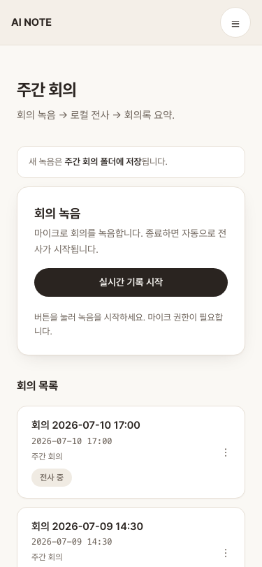

# AI NOTE

**Local-first meeting notes.** Record a meeting on your laptop → transcribe it locally with Whisper → get a clean, structured summary generated by *your own* AI (Claude CLI, Codex CLI, or a local Ollama model). AI NOTE stores its data on your machine, exposes its web/STT services only on `127.0.0.1`, has no hosted account, and never stores API keys.

The summary is yours — a `summary.json` and a Markdown transcript you can copy, download, drop into your notes, or feed anywhere else. AI NOTE does one thing: turn a recording into a good summary and hand it to you.

> UI strings are currently Korean (v0.1). Internationalization is planned — see [Roadmap](#roadmap).

## Screenshots

| Home | Structured summary | Model settings | Mobile library |
|:---:|:---:|:---:|:---:|
|  |  |  |  |

## Why it's private

- **Local app and storage.** Audio, transcripts, summaries, your optional profile, and derived search data stay under the local `data/` directory. The web server and transcription service bind to `127.0.0.1` only (never your LAN).
- **Your model choice controls inference.** Ollama keeps model inference on the configured loopback service. Claude/Codex CLI runs as a local process but may send the bounded transcript, question, and evidence context to the provider you signed in to; that processing follows the CLI provider's terms. AI NOTE adds no hosted backend of its own.
- **No API keys.** Summaries run through a CLI you're already signed in to (Claude/Codex) or a local model (Ollama). AI NOTE never stores an API key.
- **No AI NOTE telemetry.** There is no analytics or hosted sync surface. Recordings and generated artifacts live under `data/` (gitignored); model-provider traffic, if any, is determined only by the summarizer you select above.

## How it works

```
record (browser mic) → local Whisper (STT) → configured AI summary (worker) → view / search / ask / export
```

1. Click **Start** — audio is captured in the browser and saved locally.
2. On stop, a local **Whisper** service transcribes it (`raw.md`).
3. A background worker feeds the transcript to your configured model and writes a corrected transcript (`transcript.md`) + structured summary (`summary.json`) — automatically, even if you close the tab.
4. Organize meetings in local workspaces and up to three folder levels, then
   review and **copy / download / reveal the folder**.
5. Use **검색 (Search)** to find a meeting without AI. (Asking across meetings — the **질문/회의 도우미 (Questions/Meeting assistant)** chatbot — is currently on hold; see below.)

## Find and ask across meetings

> **Note — the 질문 (Questions) chatbot is currently dormant.** The **회의 도우미 (Meeting assistant)** surface is held behind a build-time flag (`MEETING_ASSISTANT_ENABLED`, default off) and is not mounted in the app while its local-CLI agent loop is reworked. Its code, the `/api/chat` route, and the shared knowledge index are preserved, not removed. Plain **검색 (Search)** below keeps working. See [decisions/0019](docs/decisions/0019-meeting-assistant-dormant.md).

Open **검색/질문** from the library navigation. The **검색 (Search)** tab performs deterministic, AI-free text matching over derived local search data, supports date/workspace/folder/status/action-item filters, and links each match back to the current live meeting. It does not scan every full transcript on every request.

The **질문 (Questions)** surface — currently dormant (see the note above) — reuses your configured summarizer through a bounded set of meeting-search and meeting-read tools. AI NOTE publishes a factual claim only when its cited meeting was actually read and is still live, assigns stable `[n]` numbers on the server, and lists the referenced meetings below the answer. This validates source provenance rather than automatically proving the model's interpretation, so important conclusions should still be checked against the linked meeting.

Conversation context is limited to four complete turns in the current browser tab and is never written to a chat-history file; refresh clears it. The optional **내 정보 (My information)** section in Settings can add a display name, aliases, timezone, and week-start preference for questions such as “my action items,” but leaving it unset does not block ordinary search or questions. If search data is incomplete, the page keeps the current query/answer visible and offers a synchronous **검색 데이터 업데이트 (Update search data)** action.

The library rail supports workspace switching, All / Unfiled / direct-folder
views, workspace and folder creation/renaming, and semantic folder colors.
Meeting files stay at their stable `data/meetings/{id}/` paths; organization is
metadata only. If the registry cannot be read, the app keeps meetings visible in
a read-only last-good or global fallback view instead of silently rewriting it.
Only a corrupt registry offers explicit rebuild: the app requires the latest
fingerprint, preserves the original in a private local archive, creates a new
library generation, and places discovered live meetings in the new default
workspace's Unfiled view. Newer-format, I/O, unsupported-durability, and
ambiguous recovery states remain read-only and are never overwritten. Recovery
archives may contain local metadata and are retained under `data/` until you
remove them locally; their paths and contents are never returned to the browser.

Recording is available from every library scope. The destination is captured
when recording starts; interrupted saves keep the same meeting ID and audio in
memory, probe the local server before retrying, and report the actual/fallback
location separately from playback and transcription status.

Meetings can move to any workspace, folder, or Unfiled location without moving
their artifact directory. Folder subtrees can be reparented within their current
workspace; cross-workspace folder moves are intentionally not supported.

Deleting a folder or workspace is an organization-only operation: a preview
shows every affected meeting, hidden placement, child folder, and pending save
intent. Meetings and their recordings/transcripts/summaries are rehomed and
preserved; only the selected container metadata is removed.

## Requirements

| | |
|---|---|
| **Node.js** | ≥ 20 |
| **Python** | 3.11 or 3.12, via [`uv`](https://docs.astral.sh/uv/) (for the Whisper service) |
| **ffmpeg** | on your `PATH` (or set `FFMPEG_PATH`) |
| **A summarizer** | one of: **Claude CLI**, **Codex CLI**, or **[Ollama](https://ollama.com)** running locally |

### Platform support

| Platform | Transcription |
|---|---|
| **Apple Silicon (M-series)** | fast — uses `mlx-whisper` |
| **Linux / Windows / Intel Mac** | works — CPU fallback via `faster-whisper` (slower, no GPU path) |

The first run downloads a Whisper model. The default (`large-v3`) is multi-GB; set `LOCAL_STT_MODEL=base` (or `small`) for a much faster first run.

## Quick start

```bash
npm install        # deps (+ husky hooks)
npm run setup      # check prerequisites (Node/uv/ffmpeg/summarizer) — optional but helpful
npm run dev        # Next.js + local Whisper service (needs uv)
```

Open http://localhost:3000, pick a summarizer in **Settings**, and record.

Using an AI agent? Point Claude Code or Codex at this repo and ask it to install — it follows the step-by-step `## 설치` procedure in [AGENTS.md](AGENTS.md). (`npm run setup` is the same check the agent runs.)

```bash
npm test           # vitest
npm run build      # production build (passes with no secrets/env)
npm run lint
npm run typecheck
npm run check:links
```

Contributors running deterministic browser regression install the pinned Chromium build once, then use the read-only doctor and repository-owned Playwright command:

```bash
npm run test:e2e:install  # one-time browser binary install
npm run test:e2e:doctor   # Node/package/browser compatibility only; no mutation
npm run test:e2e          # Chromium at desktop 1440 + mobile 390/320
```

The E2E command runs against an allowlisted temporary snapshot with an empty `data/` directory, synthetic `HOME`, disabled worker, disconnected synthetic Whisper state, no configured model, and no external browser traffic. It never copies `data/`, `glossary.json`, `.env*`, or credentials. Screenshots and the evidence manifest are local ignored output under `test-results/`. Chrome DevTools MCP is optional for qualitative inspection of an existing Chrome session; it is not the repeatable browser gate. See [ADR 0020](docs/decisions/0020-deterministic-synthetic-browser-verification.md).

## Configuration

Copy `.env.example` to `.env.local` and adjust as needed. Common knobs:

| Env | Default | Purpose |
|---|---|---|
| `LOCAL_STT_MODEL` | `large-v3` | Whisper model (`base`/`small` for speed) |
| `LOCAL_STT_LANG` | `ko` | Whisper decode language (`auto` to detect) |
| `LOCAL_STT_VAD` | `1` | Silence/hallucination filter (VAD); `0` to disable |
| `LOCAL_STT_HOST` / `LOCAL_STT_PORT` | `127.0.0.1` / `8123` | Whisper service address |
| `FFMPEG_PATH` | (from `PATH`) | Explicit ffmpeg binary |

Manage domain terms and "misheard → correct" pairs in the app's **단어 관리 (Glossary)** tab. They are applied by the LLM **correction** step (not the Whisper transcriber) to fix names and numbers. Stored in `glossary.json` as `{ terms, corrections }` (see `glossary.example.json`; a legacy string array is still read as `terms`).

## Project layout

| Path | Role |
|------|------|
| `src/` | Next.js app — recorder UI, API routes, domain contracts |
| `whisper/` | Local STT service (Python, `127.0.0.1`) |
| `docs/` | PRD · ARCHITECTURE · UI_GUIDE + decision records |
| `scripts/` | dev tooling (setup/link checks + isolated Playwright harness) |
| `e2e/` | synthetic Chromium scenarios and command-owned evidence reporter |

Module boundaries & data flow → [docs/ARCHITECTURE.md](docs/ARCHITECTURE.md). Working with an AI agent? Start at [AGENTS.md](AGENTS.md).

## Roadmap

- Internationalized UI (English + others)
- One-command / packaged install
- More summarizer backends

## License

[MIT](LICENSE) © 2026 Dylan

## Acknowledgements

AI NOTE stands on excellent open-source work:

- [OpenAI Whisper](https://github.com/openai/whisper) — the speech-recognition
  model behind local transcription.
- [mlx-whisper](https://github.com/ml-explore/mlx-examples/tree/main/whisper) —
  fast Whisper inference on Apple Silicon.
- [faster-whisper](https://github.com/SYSTRAN/faster-whisper) — the CPU fallback
  for Linux / Windows / Intel Mac.
- [ffmpeg](https://ffmpeg.org) — audio decoding and conversion.
- [Next.js](https://nextjs.org) — the app framework.
