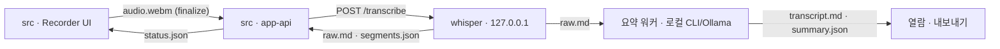

# 아키텍처 & 계약 (정본)

이 문서는 모든 build step에 주입되는 **유일한 교차-step 계약 채널**이다. 각 step은 격리 세션이므로 여기 적힌 shape/경로/enum을 그대로 따른다.

## 디렉토리 구조
```
src/
├── app/               # Next.js 페이지 + API 라우트 핸들러(Node runtime)
├── components/        # UI 컴포넌트
├── domain/            # 순수 타입/FSM/스키마 (의존 없음)
├── lib/               # atomic-write, id 검증, 파일 IO 유틸
└── services/          # whisper 클라이언트(프록시) 등 외부 래퍼
whisper/               # 로컬 Python whisper 서비스(uv 3.11/3.12 핀 venv)
scripts/               # check-links.mjs (링크 무결성 체커)
.claude/commands/      # meeting-summarize.md
data/meetings/{id}/    # 런타임 산출물(gitignore, fixtures 제외)
fixtures/              # 테스트 픽스처(커밋): raw.md, summary happy/fallback
```

## 프로세스 & 데이터 흐름
```
브라우저(녹음, 오디오만·메모리 버퍼) ─stop─▶ POST /api/meetings/{id}/finalize(바이너리 스트림)
  app-api: audio.webm 저장(atomic) + ffmpeg -c copy → play.webm + 자동 전사 위임
app-api ─POST /transcribe(202+jobId)─▶ whisper(127.0.0.1, 배치 ko large-v3)
  whisper: raw.md(세그먼트-per-line) + segments.json 디스크 기록 → 상태 HTTP 반환
  app-api: 잡 폴링 → status.json 갱신(transcribing→transcribed)
요약 워커(로컬 CLI/Ollama) {id|latest}: raw.md → summarize-core → transcript.md + summary.json
```



## 파일 소유권 (단일 writer, 동시성 없음 — 1인/1탭)
| 파일 | writer | 비고 |
|------|--------|------|
| `status.json` | **app-api만** | 생명주기 + `review`. `summarized`는 `summary.json` 존재로 파생 |
| `audio.webm` / `play.webm` | app-api | 원본 불변 / 리먹스 |
| `raw.md` + `segments.json` | whisper | 원본 불변 |
| `transcript.md` + `summary.json` | 요약 워커 | 재생성 가능 |

모든 쓰기는 **atomic(temp→fsync→rename)**. 공유 파일 동시 쓰기가 없으므로 락/낙관적 동시성 불필요.

## status.json 계약 (app-api 소유)
```jsonc
{
  "id": "uuid",                 // 경로 traversal 방지: 생성 UUID/안전 slug만
  "title": "회의 2026-07-05 22:30",   // 자동; summarize 시 app-api가 summary.title로 승격
  "status": "recording|recorded|transcribing|transcribed|summarizing|summarized",
  "error": { "message": "...", "action": "retry_transcription|retry_summary|..." } | null,
  "startedAt": "ISO", "endedAt": "ISO|null", "durationMs": 0, "audioMime": "audio/webm;codecs=opus",
  "whisper": { "jobId": "...|null", "progress": 0.0 },
  "paths": { "audio":"...","play":"...","raw":"...","transcript":"...","summary":"...","segments":"..." },
  "review": { "participants": [] },  // 상세 UI(app-api 경유) 입력
  "updatedAt": "ISO"
}
```
**FSM 6상태:** `recording → recorded → transcribing → transcribed → summarizing → summarized`. 임의 상태에서 오류 시 `error{message,action}` 세팅(상태는 유지); 복구=사용자가 "재시도" → 직전 정상 상태로 재진입. `recording`은 클라이언트 임시 상태, 서버 영속은 `recorded`부터.

## summary.json 스키마
정본(happy): `{title, topicSlug, oneLine, purpose, participants[], highlights[], discussion[], decisions[], actionItems[{owner,task,due}], risks[], followups[]}`. zod로 검증. **happy + fallback 두 픽스처 커밋.**

**중요 — fallback도 이 스키마를 준수해야 한다.** 재사용 `fallback_summary`의 `structured`는 `actionItems`를 객체로 주지만 **`purpose`가 없고 `highlights`가 빠져 있다.** summarize-core는:
- `purpose` 필드를 항상 포함(fallback 시 `""`).
- `highlights`를 항상 포함(fallback 시 `structured`에 `discussion[:3]` 등으로 채움).
- `participants`는 **비운다(`[]`)** — 참석자는 `status.review`(사용자 입력)만 authoritative. 모델이 전사에서 주운 이름을 자동 기록 금지(거짓 attendees edge·프라이버시).

## whisper HTTP 계약 (127.0.0.1)
- **주소 고정(계약)**: `LOCAL_STT_HOST=127.0.0.1`, `LOCAL_STT_PORT=8123`. whisper는 여기에 바인딩하고, app-api 프록시/클라이언트는 이 env를 (핸들러 내 지연) 읽어 접속한다. step1이 env 기본값으로 제공, step2가 바인딩, step3가 프록시.
- `GET /health` → `{ ok, model, ready }` (app-api가 same-origin 프록시 `/api/whisper/health`로 노출).
- `POST /transcribe` `{ audioPath, rawPath, segmentsPath }` → `202 { jobId }`. 잡 폴링 `GET /jobs/{jobId}` → `{ status:"processing|done|error", progress, error? }`.
- whisper가 `raw.md`(세그먼트-per-line, 분할점 보장) + `segments.json`(`[{start,end,text}]`)을 **주어진 경로에 디스크 기록**.
- `FAKE_WHISPER=1` 스텁이 **동일 계약** 준수(모델 없이 canned segments 반환) → hermetic 테스트용.
- ffmpeg는 mlx-whisper가 CLI 호출 → whisper·app-api(리먹스) 양쪽 **preflight** 체크(`/opt/homebrew/bin/ffmpeg`).

## 프롬프트 (교정·요약)

**용어집(glossary) 시드** — `glossary.json`은 빈 배열 `[]`로 시작하고, 사용자가 자기 도메인 용어를 채운다. 형식 예시는 `glossary.example.json` 참조:
```
["Kubernetes", "OKR", "roadmap"]
```

**교정(refine) 프롬프트 헤더** (`{glossary}`=쉼표 결합):
```
다음은 한국어 회의를 음성인식(STT)으로 전사한 원문입니다.
당신의 역할은 STT 오인식 교정기입니다. 규칙을 반드시 지키세요.
1) 잘못 인식된 단어·띄어쓰기·맞춤법·문장부호·문단 구분을 자연스럽게 교정합니다.
2) 발화 내용을 추가/삭제/요약/의역하지 않습니다. 말한 것을 최대한 보존합니다.
3) 군더더기(음..., 어..., 의미 없는 반복)는 가독성을 위해 최소한으로만 정리할 수 있습니다.
4) 다음 도메인 용어를 우선 적용해 교정하세요: {glossary}
5) 교정된 전사 텍스트만 출력합니다. 설명/머리말/코드블록 금지.

[원문]
```
- **길이 sanity guard**: 교정본 길이가 원문의 30% 미만이면 그 부분은 원문 유지(over-edit 방지). MVP는 단일패스(전체를 한 번에). refine 실패/폴백 시에도 최소 세그먼트→문장 병합으로 가독 floor 확보.

**요약(summarize) 프롬프트**:
```
당신은 한국어 회의록 요약 도우미입니다. 아래 전사를 바탕으로 회의록을 구조화하세요.
규칙:
- 전사에 근거한 내용만 작성합니다. 추측/창작 금지.
- 담당자가 불명확하면 owner는 "TODO"로 둡니다.
- 기한이 없으면 due는 "미정".
- topicSlug만 영문 kebab-case, 나머지 텍스트는 모두 한국어.
- 출력은 순수 JSON 객체 하나만. 코드블록/설명/머리말 금지.
JSON 스키마: {SUMMARY_SCHEMA_HINT}

[회의 제목] {title}
[전사]
{transcript}
```
**SUMMARY_SCHEMA_HINT** (여기에 `purpose`를 추가해 사용):
```
{"title":"회의 제목(한국어)","topicSlug":"english-kebab-core-topic","oneLine":"한 줄 요약",
 "purpose":"이 회의의 목적/안건","participants":["이름"],"highlights":["핵심 논의 불릿"],
 "discussion":["논의 상세 불릿"],"decisions":["결정사항"],
 "actionItems":[{"owner":"담당자","task":"할 일","due":"기한"}],
 "risks":["리스크/이슈"],"followups":["후속 확인/티켓 제안"]}
```
- **파싱**: `{…}` 추출 → 1회 재시도 → 스키마 검증 → 실패 시 스키마 준수 fallback.

## 상태 관리
- 서버 상태(회의 목록/상태): app-api가 `data/meetings/*/status.json`을 읽어 파생. 클라이언트는 폴링(`force-dynamic`+`no-store`).
- 클라이언트 상태: React `useState/useReducer`(녹음 세션, 탭 등). 전역 상태 라이브러리 불필요.
